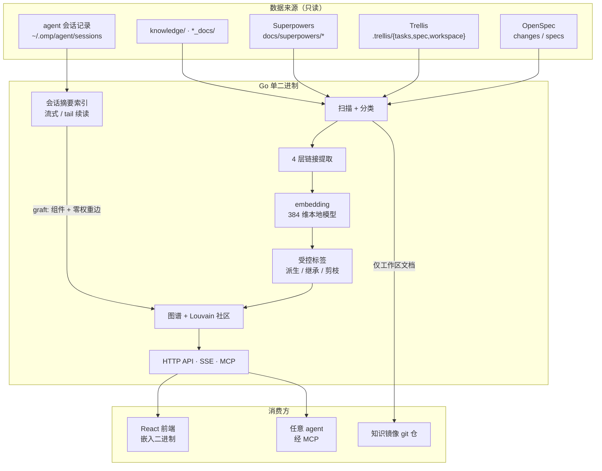

<div align="center">


### 工程知识图谱 + agent 记忆层

把 OpenSpec 变更、Trellis 任务、Superpowers 产物和 **agent 会话** 索引进一张图，
让下一个 agent 动手之前就能读到"这件事以前是怎么做的"。

**单 Go 二进制 + 嵌入式前端。下载即用。**

</div>

---

## 它解决什么

agent 每开一个新会话都在重新认识同一个仓库：翻同样的设计文档、重跑同样的搜索、重新踩同样的坑。
项目里其实已经有答案——散在 OpenSpec 变更、设计文档、验证报告，以及**过去那些会话本身**里面。

Stele 把这两类东西放进同一张图：

- **文档实体**：change / proposal / design / tasks / spec / plan / artifact / report / knowledge / diagram
- **会话实体**：agent 会话的摘要（不是原始记录），以及它 **产出 / 改动 / 读取** 过哪些文档

于是"谁写的这份方案""这份文档被哪几次会话动过""上次做这块时的意图是什么"变成一次查询，
而不是一次考古。


---

## 核心能力

| 模块 | 功能 |
|------|------|
| 🚀 **变更仪表盘** | KPI 卡片、阶段步进、任务进度环、产出物清单、多 workspace 聚合 |
| 🧠 **会话记忆层** | 会话摘要入图、会话↔文档关系边、文档页「相关会话」、会话详情（工具直方图 / 意图 / 三类文档） |
| 🗺️ **知识图谱** | Cytoscape 力导向图、多层加权 Louvain 社区、TF-IDF 主题标签 |
| 🔍 **语义搜索** | 384 维本地 embedding + cosine + 词法增强 + `tag:` 精确筛选 |
| 🏷️ **受控标签** | 五 facet 词表、别名归一、覆盖率剪枝的稀疏 tag 边 |
| 🎯 **单入口召回** | `wiki_context`：相关文档 + 动过它们的会话 + 命中的 agent 记忆产物，一个 Markdown packet |
| 📅 **时间线 / 日历** | Gantt 风格阶段着色；季度视图产物热力图 |
| ✅ **聚焦待办** | 逾期/今天/明天分组、Change 与 Wiki 关联、MCP 双向同步 |
| ✓ **文档健康** | 死链、孤儿、低连接密度、lifecycle gap、占位符残留 |
| 📊 **报告生成** | 文档驱动的周报/月报，带 `D<n>` 证据引用与 manifest 可追溯 |
| 💬 **AI 对话** | 流式 Chat，图谱模式注入 2-hop 邻域 + 社区综述 |
| 🤖 **MCP Server** | Streamable HTTP，13 个 tool 供任意 agent 调用 |

---

## 会话记忆层

### 为什么不索引原始会话记录

实测一个 30.1 MB 的真实会话：3746 行、2481 条 message（其中 1204 条是工具结果），
而人写的正文只有 62 KB——**占文件字节的 0.21%**。

所以原始记录既不进图谱，也不进 embedding，更不进知识镜像仓。解析器逐行流式读取、
按字节偏移续读，只保留计数、工具意图和碰过的文档路径。

### 关系不需要模型

工具调用自带结构化参数，交集出来就是边，零 LLM 成本：

| 来源 | 归类 |
|---|---|
| `read` 的 `path` | 读取文档 |
| `write` 的 `path` | **产出**文档（新建/整体覆盖） |
| `edit` patch 的 `[path#tag]` header | **改动**文档（打补丁） |

`bash` / `grep` / `glob` 的参数**刻意不解析**——把一个会话挂到它从未打开的文件上，比漏一条边更糟。


### 隔离契约

会话是合成实体，不是工作区文档。每条都有测试守着：

- 永不进知识镜像仓（镜像对逃逸路径**失败关闭**）
- 永不进 embedding、向量边、文档语义搜索
- 会话边权重恒为 0，不参与社区检测
- 不进 tag 语料，因此不影响任何文档 tag 边的资格与权重
- lint 既不检查会话，也不读它的字节；会话反链不会把孤儿文档变成"低连接密度"
- 前端把会话边挡在 Cytoscape 之外，点击会话进摘要卡而不是 Markdown 查看器

### 增量

60s 轮询 + `size+mtime` 失效判定 + 字节偏移续读；变更后经 SSE `sessions-updated` 推送，
文档页「相关会话」与会话详情**就地刷新**。会话记录目录不存在时该层自动关闭。

---

## 知识图谱

### 11 种组件类型

| 类型 | 来源 |
|------|------|
| `change` | OpenSpec `.comet.yaml` / Trellis `task.json` |
| `proposal` | OpenSpec `proposal.md` / Trellis `prd.md` |
| `design` | `design.md` |
| `tasks` | OpenSpec `tasks.md` / Trellis `implement.md` |
| `spec` | OpenSpec `specs/` / Trellis `.trellis/spec/` / Superpowers `docs/superpowers/specs/` |
| `plan` | `plans/` / Superpowers `docs/superpowers/plans/` |
| `artifact` | `artifacts/` / Superpowers `docs/superpowers/artifacts/` |
| `report` | `reports/` / Superpowers `docs/superpowers/reports/` |
| `knowledge` | `knowledge/` / `*_docs/` / `.trellis/workspace/` / frontmatter `wiki: true` |
| `diagram` | `diagrams/` 目录下 |
| `session` | agent 会话记录摘要（合成，只读，不镜像） |

### 6 类边

| 来源 | Kind | 说明 | 进可视图谱 | 进社区检测 |
|---|---|---|:--:|:--:|
| `yaml` | implements / references / generates | 元数据声明，置信最高 | ✅ | 权重 1.0 |
| `convention-internal` | implements / generates | 工作项内部约定连线 | ✅ | 0.9 |
| `markdown-link` | references / generates | 正文 `[text](path)` | ✅ | 0.7 |
| `vector` | similar | embedding cosine top-3（阈值 0.5） | ❌ | 0.1–0.4 |
| `tag` | `shares-tag:<name>` | 受控标签共现，覆盖率剪枝 | ❌ | 0.20–0.40 |
| `session` | reads / edits | 会话碰过的文档 | ❌ | **0** |

不进可视图谱的边仍然参与聚类与 `wiki_neighbors`——它们提供的是"latent 关联"，
不是作者写下的关系，画出来只会把图变成毛线球。


### 社区检测

- 多层加权 Louvain（γ=0.7），社区折叠后迭代重跑
- TF-IDF 主题标签（取标题里最具区分度的 3 个词，如 `kmc · kms · caller`）
- 只有完全无边的文档标为未归类
- 社区综述页由 LLM 生成并缓存

### 增量更新

- fsnotify 监控各来源的持久目录；Superpowers 仅监控 `docs/superpowers/{specs,plans,artifacts,reports}`
- 5s debounce → 增量更新；`.comet.yaml` 或 Superpowers/Trellis 产物变化触发来源级完整重建
- 内容哈希 + 输入版本校验的 embedding 缓存
- 会话层独立轮询，不与文档 watcher 抢 debounce
- SSE push → 前端自动刷新

---

## 受控标签

自由标签会退化成同义词沼泽。Stele 用一份内嵌词表（`wiki/taxonomy.yaml`，可被
`~/.stele/taxonomy.yaml` 覆盖）把它收成受控词汇：

- **五个 facet**：`product` / `platform` / `subsystem` / `activity` / `state`，107 个 canonical 词条
- **归一化**：大小写与分隔符不敏感、别名折叠、最长短语优先（`md-bus-stress` → `md-bus`）
- **派生与继承**：从 OpenSpec change 目录 slug 派生标签，并继承给该 change 的 proposal/design/tasks/spec 与关联产物；provenance 记在 `_derivedTags` / `_inheritedTags`，**不改写原文档**
- **未知标签**：保持可见可搜，但不传播、不建边
- **只有 platform/subsystem 能建边**，且需过三道闸：文档数 ≥ 3、覆盖率 ≤ 3.5%、IDF 权重落在 [0.20, 0.40]，再加全局 tag-degree ≤ 6 的贪心剪枝

在一个 1458 篇文档的真实语料上：显式标注 260 篇（17.9%）→ 生效标签覆盖 1144 篇（78.7%），
55 个标签具备建边资格，产出 566 条稀疏边。


---

## 单入口召回

agent 动手之前只需要问一次：

```
wiki_context("PCIe 三通道 通信")
```

```markdown
# Context: PCIe 三通道 通信

## Documents
- [knowledge] RX101 PCIe 三通道实测、自动化测试与仓库交接 (rx101, 100%)
  tags: rx101, pcie, cq8750s, orin, test, handoff

## Sessions that worked on these documents
- 分析 CQ 数据路径性能瓶颈 (rx101, 2026-07-31) — 3 matched document(s)
  · Inspecting CQ PCIe environment
  · Collecting deeper CQ PCIe facts
  session: ~/.omp/agent/sessions/-workspace-miao-rx101/…jsonl

## Agent memory
- summary (~/.omp/agent/memories/<project>/memory_summary.md)
  …
```

文档来自语义检索，会话来自图上的反向边，记忆产物在查询时**按需读盘**（每文件上限 4 KB，
只认文档化的几个文件名）——它们由 agent runtime 拥有并整体重写，索引它们没有意义。

---

## 架构



---

## MCP Server

Streamable HTTP 端点，让任意 agent 查询图谱、召回上下文并管理待办。
Wiki 与会话工具只读；待办写工具仅接受 loopback 且要求 Bearer token。

**端点**：`POST http://localhost:8989/mcp`

| Tool | 说明 |
|------|------|
| `wiki_context` | **动手前的单入口召回**：文档 + 相关会话 + 记忆产物，返回紧凑 Markdown |
| `wiki_search` | 语义搜索工程文档，支持 `tag:<name>` 精确筛选 |
| `wiki_sessions` | 列出 agent 会话摘要（工具统计、产出/改动/读取的文档、意图） |
| `wiki_component` | 组件详情 + 双向引用 |
| `wiki_neighbors` | 2-hop 图谱邻居 |
| `wiki_overview` | 主题社区综述 |
| `wiki_read` | 读取文档原文 |
| `wiki_lint` | 文档健康检查 |
| `todo_list` | 按状态 / workspace / Change / 关键词筛选待办 |
| `todo_create` | 创建待办（loopback + Bearer） |
| `todo_update` | 更新或清空字段（loopback + Bearer） |
| `todo_delete` | 按 ID 删除（loopback + Bearer） |
| `todo_sync_omp` | 原子同步 agent 会话的完整待办快照，带单调序列防回滚（loopback + Bearer） |

**客户端配置**。只读工具无需鉴权；写工具缺少 `Authorization` 头会返回 `write access denied`：

```json
{
  "stele": {
    "type": "http",
    "url": "http://localhost:8989/mcp",
    "headers": {
      "Authorization": "Bearer <~/.stele/mcp-write-token 的内容>"
    }
  }
}
```

---

## 快速开始

```bash
git clone https://github.com/sudashannon/stele.git
cd stele

bun install                                  # embedding 依赖
cd web && npm install && npx vite build && cd ..
go build -o stele .

./stele --port 8989 --dir /path/to/openspec-or-trellis-or-superpowers-project
```

浏览器打开 `http://localhost:8989`。

### 作为服务运行

```bash
cp stele.service ~/.config/systemd/user/     # 按需改 WorkingDirectory / ExecStart
systemctl --user daemon-reload
systemctl --user enable --now stele
```

### 注册 workspace

通过 UI 添加，或直接编辑 `~/.stele/workspaces.yaml`：

```yaml
workspaces:
    - alias: gateway
      path: /home/user/workspace/gateway/openspec
      color: '#0f62fe'
      type: openspec          # openspec | trellis | superpowers；省略则自动探测
sync:
    enabled: false
    remote: ""
```

### 会话记忆层

默认读取 `~/.omp/agent/sessions`，用 `--sessions-dir` 指定其它位置，目录不存在则自动关闭：

```bash
./stele --dir /path/to/openspec --sessions-dir ~/.omp/agent/sessions
```

只有工作目录落在**已注册 workspace 范围内**的会话才会入图（嵌套 workspace 胜过父级），
所以临时目录里的一次性会话不会污染图谱。

---

## 数据目录

所有自有状态都在 `~/.stele/`：

| 文件 | 内容 |
|---|---|
| `workspaces.yaml` | workspace 注册与同步配置 |
| `config.json` | LLM provider / model / API base |
| `todos.json` | 待办 |
| `mcp-write-token` | MCP 写鉴权 token（0600，首次启动自动生成） |
| `bookmarks.json` · `share-tokens.json` | 收藏与分享链接 |
| `taxonomy.yaml` | 可选，覆盖内嵌词表 |
| `wiki/` | 索引缓存、embedding、会话摘要、摘要与综述缓存 |
| `knowledge-repo/` | 知识镜像 git 仓（仅工作区文档，**从不含会话记录**） |
| `reports/` | 生成的周报/月报与 manifest |

`STELE_DATA_DIR` 可整体覆盖位置。项目原名 comet-panel，首次启动会把旧的
`~/.comet-panel` 与 `~/.comet-ui/config.json` **自动迁移**过来；迁移失败时继续使用旧目录并告警，
绝不从空目录起步。

---

## 明确不做

- **不改写别人的格式**：`.comet.yaml`、Trellis `task.json`、Superpowers 布局、agent 会话记录全部只读；阶段流转交给 comet-guard
- **不把原始会话记录进图谱、进 embedding、进镜像仓**
- **不自建会话蒸馏**：agent runtime 自己的记忆管道已经在做，Stele 只在召回时按需读它的产物
- **不写 agent 记忆**：写入路径属于 runtime 的 `retain` / `recall` 工具
- 无暗色模式、无批量阶段流转、无任意元数据编辑

---

## 键盘快捷键

| 快捷键 | 功能 |
|--------|------|
| `Ctrl+K` | 命令面板 |
| `Ctrl+1~8` | 切换视图：变更 / 待办 / 图谱 / 时间线 / 搜索 / 最近 / 文档健康 / 报告 |
| `Ctrl+B` | 收藏夹 |
| `Ctrl+=` `Ctrl+-` `Ctrl+0` | 缩放 50%–200% / 重置 |
| `Escape` | 关闭面板 / 查看器 / 收藏夹 |

---

## API 端点

| 端点 | 方法 | 说明 |
|------|------|------|
| `/api/workspaces` | GET / POST / DELETE | workspace 注册 |
| `/api/changes` | GET | 变更列表（多 workspace 聚合） |
| `/api/changes/{name}/transition` | POST | 阶段流转（经 comet-guard） |
| `/api/wiki/index` | GET | 全部组件 |
| `/api/wiki/graph` | GET | 组件 + 边 + 社区 |
| `/api/wiki/component/` | GET | 单组件 + 双向引用 |
| `/api/wiki/search-semantic` | POST | 语义搜索（支持 `tag:`） |
| `/api/wiki/context` | GET | 召回 packet（`?q=&limit=`） |
| `/api/wiki/sessions` | GET | 会话摘要列表 |
| `/api/wiki/session` | GET | 单会话摘要（`?id=`） |
| `/api/wiki/sessions/refresh` | POST | 立即重扫会话记录并重新挂图 |
| `/api/wiki/rebuild` | POST | 全量重建 |
| `/api/wiki/lint` | GET | 文档健康问题 |
| `/api/wiki/overview` | GET | 社区综述 |
| `/api/wiki/recent` | GET | 最近更新（`?offset=&limit=`） |
| `/api/wiki/calendar/{month,day}` | GET | 日历视图 |
| `/api/wiki/summarize` · `/api/wiki/summary` | POST / GET | LLM 文档摘要（带缓存） |
| `/api/todos` `/api/todos/{id}` | GET / POST / PATCH / DELETE | 待办 |
| `/api/reports` | GET / POST | 周报 / 月报 |
| `/api/share` `/api/share/revoke` | POST | 分享链接 |
| `/api/chat/message` | POST (SSE) | 流式对话 |
| `/api/wiki/events` | GET (SSE) | 图谱 / 待办 / 会话实时推送 |
| `/mcp` | POST | MCP JSON-RPC（8 个 wiki + 5 个待办工具） |

---

## 技术栈

| 层 | 技术 |
|---|------|
| 后端 | Go 1.26，单二进制，嵌入前端 |
| 前端 | React 18 · Vite · Tailwind CSS v4 · Cytoscape.js · Mermaid |
| 设计 | IBM Carbon Design System tokens · IBM Plex Sans |
| Embedding | Ternlight（`@ternlight/base`，384 维，本地，经 Bun 调用） |
| 图算法 | 多层加权 Louvain · TF-IDF 社区标签 · IDF 加权 tag 边 · cosine 相似度 |
| 文件监控 | fsnotify（文档）+ 独立轮询（会话记录） |
| LLM | MiniMax / Anthropic / OpenAI 可配置（摘要、综述、报告、对话） |
| 协议 | MCP Streamable HTTP（JSON-RPC 2.0）· Server-Sent Events |

---

## License

MIT
