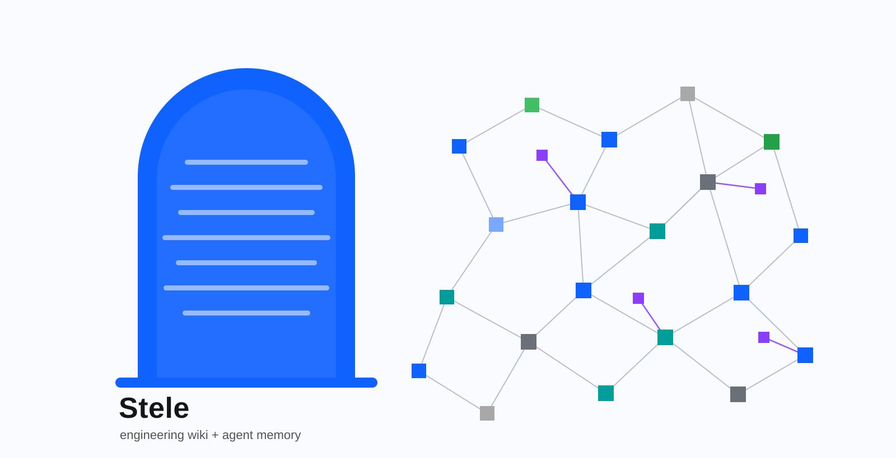
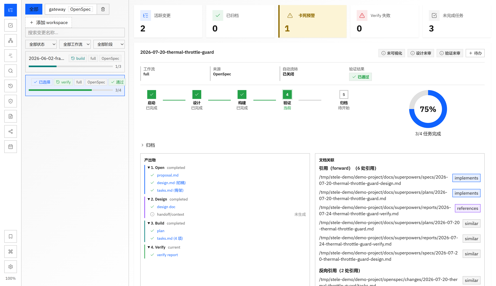
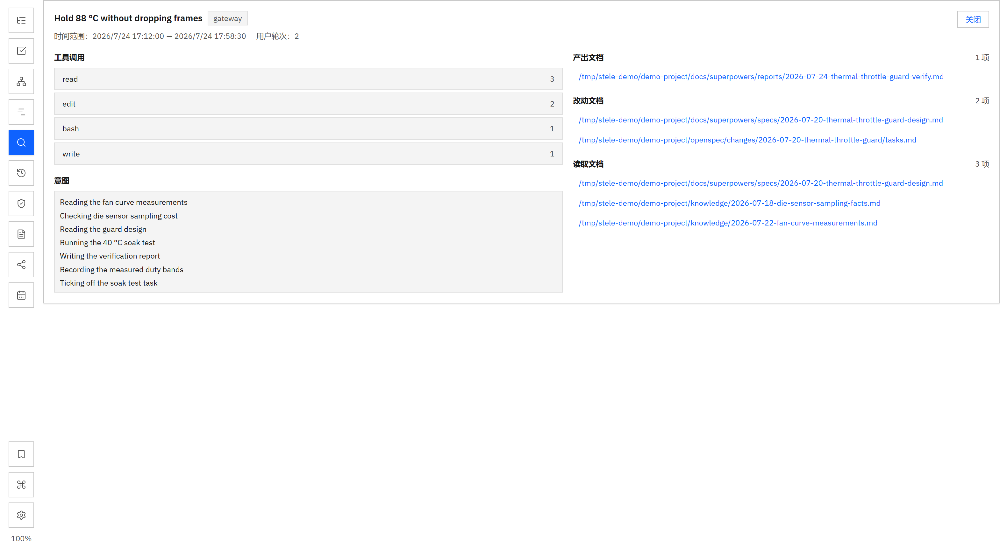
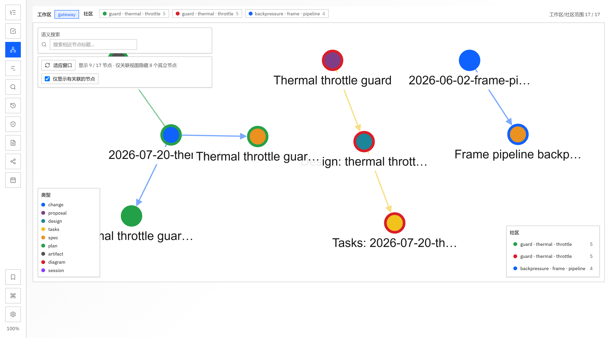
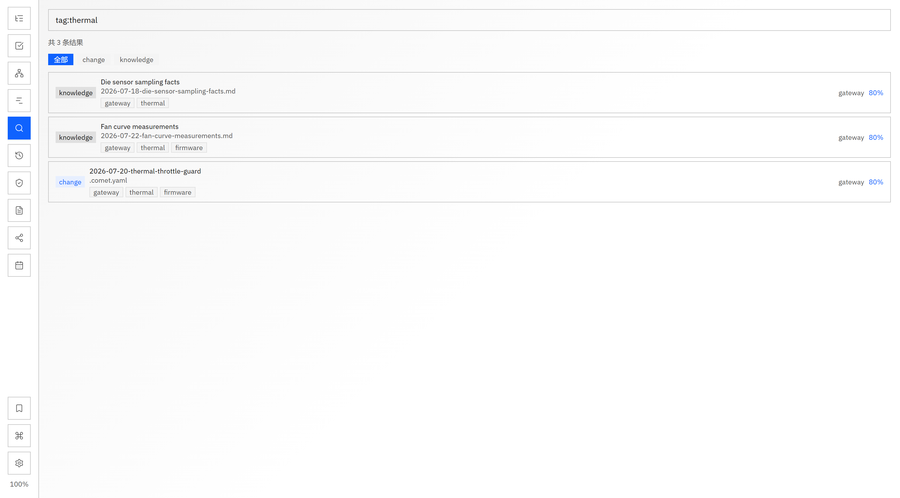
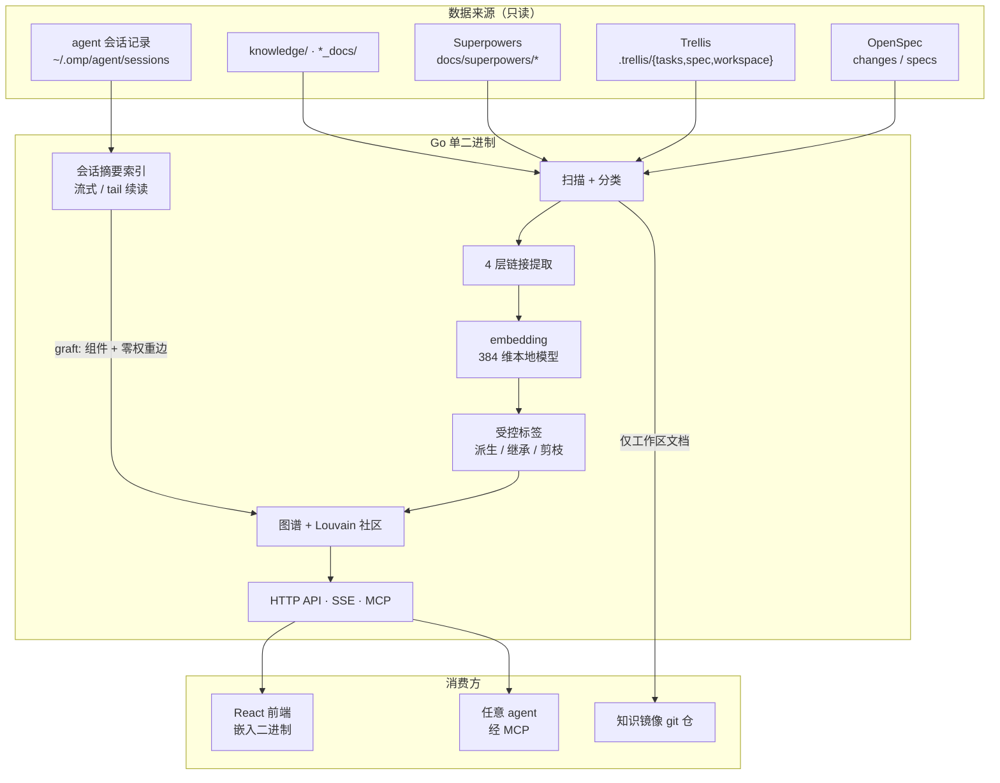

<div align="center">



### 工程知识图谱 + agent 记忆层

把 OpenSpec 变更、Trellis 任务、Superpowers 产物和 **agent 会话** 索引进一张图，
让下一个 agent 动手之前就能读到"这件事以前是怎么做的"。

**单 Go 二进制 + 嵌入式前端。下载即用。**

</div>

---

## 它解决什么

agent 每开一个新会话都在重新认识同一个仓库：翻同样的设计文档、重跑同样的搜索、重新踩同样的坑。
项目里其实已经有答案——散在 OpenSpec 变更、设计文档、验证报告，以及**过去那些会话本身**里面。

Stele 把这两类东西放进同一张图：

- **文档实体**：change / proposal / design / tasks / spec / plan / artifact / report / knowledge / diagram
- **会话实体**：agent 会话的摘要（不是原始记录），以及它 **产出 / 改动 / 读取** 过哪些文档

于是"谁写的这份方案""这份文档被哪几次会话动过""上次做这块时的意图是什么"变成一次查询，
而不是一次考古。



---

## 核心能力

| 模块 | 功能 |
|------|------|
| 🚀 **变更仪表盘** | KPI 卡片、阶段步进、任务进度环、产出物清单、多 workspace 聚合 |
| 🧠 **会话记忆层** | 双 runtime（omp / claude-code）会话摘要入图、会话↔文档边、**Agent 会话面板**（筛选未完成/工作区/运行时、每日活跃、待办轨迹与阻塞原因、未完成项一键转待办）|
| 🗺️ **知识图谱** | Cytoscape 力导向图、多层加权 Louvain 社区、TF-IDF 主题标签 |
| 🔍 **语义搜索** | 384 维本地 embedding + cosine + 词法增强 + `tag:` 精确筛选 |
| 🏷️ **受控标签** | 五 facet 词表、别名归一、覆盖率剪枝的稀疏 tag 边 |
| 🎯 **单入口召回** | `wiki_context`：相关文档 + 动过它们的会话 + 命中的 agent 记忆产物，一个 Markdown packet |
| 📅 **时间线 / 日历** | 三层活动时间线（变更 / 文档 / 会话按天，可切口径、自动定位今天）；季度视图产物热力图 |
| ✅ **聚焦待办** | 逾期/今天/明天分组、Change 与 Wiki 关联、MCP 双向同步 |
| ✓ **文档健康** | 死链、孤儿、低连接密度、lifecycle gap、占位符残留 |
| 📊 **报告生成** | 周报按**会话投入**分配版面（不按文档数），带 `D<n>` 证据引用与 manifest 可追溯 |
| 💬 **AI 对话** | 流式 Chat，图谱模式注入 2-hop 邻域 + 社区综述 |
| 🤖 **MCP Server** | Streamable HTTP，13 个 tool 供任意 agent 调用 |

---

## 会话记忆层

### 为什么不索引原始会话记录

实测一个 30.1 MB 的真实会话：3746 行、2481 条 message（其中 1204 条是工具结果），
而人写的正文只有 62 KB——**占文件字节的 0.21%**。

所以原始记录既不进图谱，也不进 embedding，更不进知识镜像仓。解析器逐行流式读取、
按字节偏移续读，只保留计数、工具意图和碰过的文档路径。

保留的意图是**最近的**那一窗，不是最早的。实测一个会话在 109.5 小时里做了 2573 次带意图的
调用——按"填满就丢弃后续"保留，展示的会是四天前的那 0.9 小时；现在是滑动窗口，UI 上写的
"最近若干条"因此才是真的。上限的字符预算同样从最旧那头裁。

### 一个会话 = 一件事的完整足迹

agent 派出的 subagent 各写自己的记录（OMP 放在父记录同名目录下，可再嵌套一层）。
这些记录**折叠进派它的那次会话**，而不是变成独立节点：

- subagent 改的文档在因果上属于派它的那次会话，分开会把一件事碎成几十条
- 不折叠则父会话**系统性低报**自己干的活。实测本机：`安全鉴权` 折叠 76 个 subagent 后，
  工具调用 5457 → **9467**，产出/改动 18 → 20 篇，读取 20 → 28 篇
- 折叠后节点数不变（14 条会话，其中 10 条含 subagent，共折叠 194 份记录）

三件事**刻意不合并**：身份（id / title / cwd / source 只认主记录，否则会话会被重新归属到
subagent 恰好运行的目录）、**用户轮次**（subagent 的 `user` 消息是编排者的提示词，不是人的轮次），
以及断点续读位置（每个文件各自记 offset，所以追加一份 subagent 记录只重读那一份）。

### 接入其他 agent 只需一个 provider

运行时特化的东西全部收在 `internal/sessions` 的一个接口后面：

```go
type Provider interface {
    Name() string                                     // 出现在缓存键、API 与 UI 上
    Discover(root string) ([]Unit, error)             // 布局：哪些文件算同一次会话
    Parse(path string, prev *Digest) (*Digest, error) // 格式：事件形状与工具名归类
}
```

`Digest` 往下——归属、挂图、零权重边、隔离契约、摘要、REST、MCP、前端面板——**与运行时无关**，
新增一个 agent 不用碰。折叠语义也是通用的（`Merge`），provider 只需说清"哪些文件是一组"。

已有两个实现：`omp` 与 `claude-code`（`~/.claude/projects/<slug>/<uuid>.jsonl`）。后者验证了抽象确实够用，
也暴露了两处必须诚实降级的地方：它的工具调用**没有 intent 字段**（意图列表留空，不做启发式合成，
编出来的意图会污染召回），它的任务工具 `TodoWrite` 每次传**整份状态**而非操作流（因此没有"历史完成"
可携带，`TodoReplans` 恒为 0）。工具名保持各自 runtime 的原样（`Read`/`Write`/`Edit` 对 `read`/`write`/`edit`），
路径归类与"哪些工具的参数刻意不解析"同样是 provider 自己的知识。

多运行时同时挂载：

```bash
./stele --sessions-source omp=~/.omp/agent/sessions --sessions-source other=~/.other/sessions
```

`--sessions-dir` 保留为 omp 的简写。目录不存在的源静默跳过（本机没装那个 runtime 是常态），
而**运行时名字拼错会直接启动失败**——那是配置错误，不该猜。面板的运行时筛选框只在
真的有两个以上运行时产出会话时才出现。

### 关系不需要模型

工具调用自带结构化参数，交集出来就是边，零 LLM 成本：

| 来源 | 归类 |
|---|---|
| `read` 的 `path` | 读取文档 |
| `write` 的 `path` | **产出**文档（新建/整体覆盖） |
| `edit` patch 的 `[path#tag]` header | **改动**文档（打补丁） |

`bash` / `grep` / `glob` 的参数**刻意不解析**——把一个会话挂到它从未打开的文件上，比漏一条边更糟。

### 会话待办：它当初打算做什么

会话自己的任务清单也是结构化的（`init` / `start` / `done` / `block` / `drop` / `append` / `rm`），
重放这些操作即可还原它结束时的清单，无需 LLM。详情卡里分两栏：

- **当前清单**：按 phase 分组，带最终状态（已完成 / 进行中 / 阻塞 / 待办 / 已放弃）
- **早先完成**：`init` 会整份替换清单，所以每次重新规划前先把已完成条目收进历史——
  否则一个六小时的会话只会显示最后 4 条待办，看起来什么都没干。实测 `安全鉴权`：
  重新规划 **106 次**，最终清单 4 条，历史完成 **200 条**（触及上限）

`block` 的**原因一并保留**——对卡住的任务，原因是唯一能拿去行动的信息，只写"阻塞"等于没写。
任务转成其它状态时原因随之清空。面板可以按"仅未完成清单"筛选，并在行上标出未完成数量，
详情卡里能把这些未完成项**一键建成待办**（关联回本会话，走普通待办路径，不碰 runtime 自己的同步游标）。

清单**不参与折叠**：subagent 跟踪的是被分派那一小片的拆解，混进来会把人写的计划埋掉
（实测 76 个 subagent 一个都没用 todo 工具）。清单只随单会话接口返回，不进列表接口——
一次重规划密集的会话能带几百条任务串，列表行不显示它，agent 调 `wiki_sessions` 也不需要它占上下文。

另一个 runtime 的任务工具形状不同（比如整份状态数组而非操作流），所以重放逻辑归 provider，
`Digest.Todos` 只收结果。



### 两个方向

文档页的「相关会话」是从文档看会话；**Agent 会话面板**（功能栏第 2 项，`Ctrl+2`）是反方向——
全部已索引会话按天分组，每行给出它产出/改动与读取了多少篇文档、几轮对话、调用最多的三个工具，
以及前两条意图。

- 搜索框同时命中标题、意图和**文档路径**——人记得住的是文件名，不是会话标题
- 可按工作区筛选，或只看"有产出或改动"的会话（真正改过东西的那批）
- 「重扫」立即重读会话记录，不必等轮询；缺少会话目录时面板直说**未启用**，而不是显示一个空列表
- 点任意会话进详情卡（工具直方图 / 意图 / 三类文档 / **会话待办**）；从详情里点文档则进 Markdown 查看器

### 跨天会话：起止不是时长

一次会话可以被 resume 好几天：实测最长的跨 9 天。`startedAt → updatedAt` 因此是一个**区间**，
其间大部分时间并没有人在。digest 为每个自然日记一个「轮次 + 工具调用」计数，于是：

- 面板行显示「活跃 N 天」，不再让一个活跃五天的会话只出现在"今天"
- 详情卡有每日活跃条（含峰值），空白的那天就是真的没干活
- subagent 的活跃度按天并入父会话——它的工作发生在真实的某一天

### 隔离契约

会话是合成实体，不是工作区文档。每条都有测试守着：

- 永不进知识镜像仓（镜像对逃逸路径**失败关闭**）
- 永不进 embedding、向量边、文档语义搜索
- 会话边权重恒为 0，不参与社区检测
- 不进 tag 语料，因此不影响任何文档 tag 边的资格与权重
- lint 既不检查会话，也不读它的字节；会话反链不会把孤儿文档变成"低连接密度"
- 前端把会话边挡在 Cytoscape 之外，点击会话进摘要卡而不是 Markdown 查看器

### 增量

稳态是 60s 轮询 + `size+mtime` 失效判定 + 字节偏移续读（实测一轮几十毫秒）。冷启动是另一回事：
缓存 schema 一升，全量重解析 **724.7 MB / 368 份记录约 20s（36 MB/s）**，耗时会打进日志。
凡是改动 digest **派生内容**的改动都必须 bump schema——未变动的记录永不重解析，
旧缓存会一直提供缺字段的摘要（这个坑踩过两次）。变更后经 SSE `sessions-updated` 推送，
文档页「相关会话」、会话面板与会话详情**就地刷新**，索引里的会话组件同步更新（否则新会话会被
当成普通文档打开）。会话记录目录不存在时该层自动关闭。

## 周报：按投入分配版面，不按文档数

文档数不是工作量。实测某周：一次 NVIDIA 官方文档批量导入一天产出 **189 个 md**，
吃掉了 8 个主题里的 6 个；同一周六个真正在推进的会话（9262 / 5357 / 3420 / 2472 / 2307 / 1796
次记录事件）各产出十来篇文档，被压进一个「独立事项」里共 5 条 claim。

现在骨架是**投入轴**：

| 层 | 来源 | 谁生成 |
|---|---|---|
| 本周投入表 | 会话记录中落在窗口内的活跃天与事件数 | 确定性渲染，不过模型 |
| 每个工作项一节 | 一个会话 = 一节，按投入降序 | claim 由模型写，只能引用 `D<n>` 文档 |
| 其他工作项 | 超过 8 个叙述位的会话合并 | 投入表仍逐个列出，不隐藏 |
| 无会话归属主题 | 没有会话写过的文档，按内容聚类 | 标注「仅按内容归并」 |
| 批量资料导入 | 同目录子树 + 同日入库 + 无任何会话写入/编辑 | 只计数与路径，**不生成结论** |
| 未完成与阻塞 | 会话自己的任务记录与阻塞原因 | 确定性渲染，不过模型 |

归属只认**写入与编辑**，不认读取——读过一篇文档不等于产出它，否则一周的功劳会归给读得最多的会话。
同一篇被两个会话碰过时归投入更大的那个。会话产出为零仍会出现在投入表里(「活跃 6 天、没写文档」
是信息)，但不会凭空得到一节:claim 必须有文档哈希可引。

### 无会话归属文档的两条结构规则

剩下那些没人的会话写过的文档要按内容归并，两个实测缺陷说明纯相似度不够用：
一份设计与它的实施计划被拆成两节（「…设计规格」和「…实施计划」），
而一对 Qwen/BitNet 训练文档（workspace `miao`）被并进了 LZ100 工站那节（workspace `lz100`）——
两边都常提 LZ100，余弦就过了 0.58。两条修正都不引入新阈值：

| 规则 | 判据 | 修掉什么 |
|---|---|---|
| **同工作项兄弟文档硬合并** | 同目录 + 同 slug，只差结尾那个词（`-design` / `-plan` / …），日期前缀忽略 | 设计与计划回到同一节 |
| **跨工作区合并必须有边** | 两簇工作区不相交且 affinity = 0 就拒绝合并 | Qwen 训练文档不再蹭进工站节 |

兄弟规则**故意不设尾缀白名单**：同目录同 slug 的两份文档说的就是同一件事，
白名单只会在别人发明新文档类型时又漏一次。图谱的硬边只覆盖结构化布局
（`openspec/changes/<name>/{proposal,design,tasks}.md`、`docs/superpowers/` 的 slug 记录），
平铺的 `knowledge/YYYY-MM-DD-<slug>-{design,plan}.md` 本来一条边都没有。
跨工区规则只管**语义合并**：会话按产出认领文档时不受影响——一个会话在 `miao/` 和 `miao/lz100/`
各写一篇是常态，那是作者关系，不是猜的。「独立事项」这个兜底筐也不受约束，它本就不声称相关性。

### 一节能代表多少文档

散文有代表能力的上限：一节最多 8 条 claim，每条引几篇文档，所以**约 24 篇**就是一节还能描述自己的边界。
这个数不是拍的——实测有一节装了 **275 篇、跨 112 个目录 / 22 天，claim 只引了 9 篇**，那不是摘要，是给一堆文件贴了个标签。
超过这条线的无会话簇不再叙述，改为**按目录计数**：

| 计数类型 | 判据 | 措辞 |
|---|---|---|
| 批量资料导入 | 同目录子树 + 同日入库 + 零会话边 | 「同日批量导入」 |
| 期间变更 | 本期有更新但无会话产出记录，且簇已超过可叙述规模 | 「期间变更（无会话记录）」 |

两者都只给目录、日期跨度和篇数，不生成结论——把一个月的零散改动叫「导入」是错的，把它写成成果更错。

## 月报：由周组装，不重新聚类

月报的骨架和周报同源:**同一个会话跨四周就是一个工作项**,四周投入相加,而不是把周主题的散文再聚一次类。
实测旧做法的后果:40 多个周主题按余弦并成 **3 个**月主题,一个装 317 篇,而 225 篇文档不属于任何主题。

- **缺失的周按周补齐**:一个月若没有可复用的周报,过去会当成**一个 31 天窗口**跑——窗口一长,无会话文档挤成一坨,
  结果 583 篇里 490 篇只能计数。现在缺口按 7 天切片,一个月的章节结构与它由哪些周组成保持一致。
- **兜底筐只和兜底筐合并**:周报的「独立事项」是个筐不是主题,放进语义合并会把有名字的主题一起拖进去。
- **宏观也按可叙述规模打包**:十个各自可叙述的周主题不等于一个可叙述的月主题(实测并出 192 篇一节),
  因此按文档数装箱;单个周主题本身超限时保持整体,不拆到两节。
- **正文里的 `D<n>` 会跟着重编号**:月报会重新编号文档,周报正文里写的 `D27` 若不改就会和括号里的 `[D355]` 自相矛盾(实测 12 处)。
  映射不到的编号直接删掉——括号里的引用才是机器校验过的真相。提示词也已禁止在正文里写编号。
- **确定性优先**:概述只有计数与投入,主线是投入前三的工作项,投入表/未完成与阻塞/计数分组都不过模型;
  每条 claim 全页只出现一次(里程碑 > 关键成果 > 主题条目 > 重点项目)。

证据契约没动:会话是派生事实,永不作为证据被引用,`D<n>` 始终指向人写的正文。

### manifest schema

| 版本 | 新增的**保证** |
|---|---|
| v2 | 投入轴:`sessions` / `bulkImports` / 每主题 `sessionId` 与 `effort` |
| v3 | 规模保证:被叙述的主题不超过可叙述规模,超限的簇只计数 |

月报**只复用当前版本**的周报摘要。两种更宽松的做法都试过并量到了代价:复用 v1 会把 296 篇塞进一节,
复用 v2 会带进一个 78 篇、claim 只引几篇的主题。拒绝旧摘要不会丢数据——那一周会用当前管线重新生成。

---

## 时间线

三层数据叠在同一条工作区轴上，可切口径（**全部 / 变更 / 文档 / 会话**，默认全部）：

| 层 | 数据 | 画法 |
|---|---|---|
| 变更 | `change` + 阶段色 | 条形，跨度取 `created_at → updatedAt` |
| 文档 | 其余全部组件 | 细刻度，按类型着色（实测中位跨度 1 天，密集期自然成带） |
| 会话 | 每日活跃计数 | 行底细带，一天一格 |

原先只画 `change`，于是**七月中旬后整片空白**——最后一个 change 停在 2026-07-21，而之后写的 320 篇
文档（`knowledge 249 / spec 22 / plan 18 / …`）一条都不画；没有 change 的 superpowers 工作区
（lz100）甚至没有行。同一次修复还治了两个更隐蔽的毛病：

- 图表是 flex 子项，被 `flex-shrink` **压到容器宽度**，`PX_PER_DAY` 一直无效、几个月挤成一屏
- 打开时停在最旧一端，现在自动定位到今天（延后一帧赋值 `scrollLeft`，否则会被布局钳成 0）

空态也不再留白：会说明"当前口径没有数据"并列出其它口径各有多少。社区筛选**不含会话**（会话不属于任何社区），
这一点会在筛选摘要里写明，而不是静默排除。

---

## 知识图谱

### 11 种组件类型

| 类型 | 来源 |
|------|------|
| `change` | OpenSpec `.comet.yaml` / Trellis `task.json` |
| `proposal` | OpenSpec `proposal.md` / Trellis `prd.md` |
| `design` | `design.md` |
| `tasks` | OpenSpec `tasks.md` / Trellis `implement.md` |
| `spec` | OpenSpec `specs/` / Trellis `.trellis/spec/` / Superpowers `docs/superpowers/specs/` |
| `plan` | `plans/` / Superpowers `docs/superpowers/plans/` |
| `artifact` | `artifacts/` / Superpowers `docs/superpowers/artifacts/` |
| `report` | `reports/` / Superpowers `docs/superpowers/reports/` |
| `knowledge` | `knowledge/` / `*_docs/` / `.trellis/workspace/` / frontmatter `wiki: true` |
| `diagram` | `diagrams/` 目录下 |
| `session` | agent 会话摘要（合成，只读，不镜像；subagent 记录折叠进派它的会话） |

### 6 类边

| 来源 | Kind | 说明 | 进可视图谱 | 进社区检测 |
|---|---|---|:--:|:--:|
| `yaml` | implements / references / generates | 元数据声明，置信最高 | ✅ | 权重 1.0 |
| `convention-internal` | implements / generates | 工作项内部约定连线 | ✅ | 0.9 |
| `markdown-link` | references / generates | 正文 `[text](path)` | ✅ | 0.7 |
| `vector` | similar | embedding cosine top-3（阈值 0.5） | ❌ | 0.1–0.4 |
| `tag` | `shares-tag:<name>` | 受控标签共现，覆盖率剪枝 | ❌ | 0.20–0.40 |
| `session` | reads / edits | 会话碰过的文档 | ❌ | **0** |

不进可视图谱的边仍然参与聚类与 `wiki_neighbors`——它们提供的是"latent 关联"，
不是作者写下的关系，画出来只会把图变成毛线球。



### 社区检测

- 多层加权 Louvain（γ=0.7），社区折叠后迭代重跑
- TF-IDF 主题标签（取标题里最具区分度的 3 个词，如 `kmc · kms · caller`）
- 只有完全无边的文档标为未归类
- 社区综述页由 LLM 生成并缓存

### 增量更新

- fsnotify 监控各来源的持久目录；Superpowers 仅监控 `docs/superpowers/{specs,plans,artifacts,reports}`
- 5s debounce → 增量更新；`.comet.yaml` 或 Superpowers/Trellis 产物变化触发来源级完整重建
- 内容哈希 + 输入版本校验的 embedding 缓存
- 会话层独立轮询，不与文档 watcher 抢 debounce
- SSE push → 前端自动刷新

---

## 受控标签

自由标签会退化成同义词沼泽。Stele 用一份内嵌词表（`wiki/taxonomy.yaml`，可被
`~/.stele/taxonomy.yaml` 覆盖）把它收成受控词汇：

- **五个 facet**：`product` / `platform` / `subsystem` / `activity` / `state`，107 个 canonical 词条
- **归一化**：大小写与分隔符不敏感、别名折叠、最长短语优先（`md-bus-stress` → `md-bus`）
- **派生与继承**：从 OpenSpec change 目录 slug 派生标签，并继承给该 change 的 proposal/design/tasks/spec 与关联产物；provenance 记在 `_derivedTags` / `_inheritedTags`，**不改写原文档**
- **未知标签**：保持可见可搜，但不传播、不建边
- **只有 platform/subsystem 能建边**，且需过三道闸：文档数 ≥ 3、覆盖率 ≤ 3.5%、IDF 权重落在 [0.20, 0.40]，再加全局 tag-degree ≤ 6 的贪心剪枝

在一个 1458 篇文档的真实语料上：显式标注 260 篇（17.9%）→ 生效标签覆盖 1144 篇（78.7%），
55 个标签具备建边资格，产出 566 条稀疏边。



---

## 单入口召回

agent 动手之前只需要问一次：

```
wiki_context("PCIe 三通道 通信")
```

```markdown
# Context: PCIe 三通道 通信

## Documents
- [knowledge] RX101 PCIe 三通道实测、自动化测试与仓库交接 (rx101, 100%)
  tags: rx101, pcie, cq8750s, orin, test, handoff

## Sessions that worked on these documents
- 分析 CQ 数据路径性能瓶颈 (rx101, 2026-07-31) — 3 matched document(s)
  · Inspecting CQ PCIe environment
  · Collecting deeper CQ PCIe facts
  session: ~/.omp/agent/sessions/-workspace-miao-rx101/…jsonl

## Agent memory
- summary (~/.omp/agent/memories/<project>/memory_summary.md)
  …
```

文档来自语义检索，会话来自图上的反向边，记忆产物在查询时**按需读盘**（每文件上限 4 KB，
只认文档化的几个文件名）——它们由 agent runtime 拥有并整体重写，索引它们没有意义。

---

## 架构



---

## MCP Server

Streamable HTTP 端点，让任意 agent 查询图谱、召回上下文并管理待办。
Wiki 与会话工具只读；待办写工具仅接受 loopback 且要求 Bearer token。

**端点**：`POST http://localhost:8989/mcp`

| Tool | 说明 |
|------|------|
| `wiki_context` | **动手前的单入口召回**：文档 + 相关会话 + 记忆产物，返回紧凑 Markdown |
| `wiki_search` | 语义搜索工程文档，支持 `tag:<name>` 精确筛选 |
| `wiki_sessions` | 列出 agent 会话摘要（工具统计、产出/改动/读取的文档、意图） |
| `wiki_component` | 组件详情 + 双向引用 |
| `wiki_neighbors` | 2-hop 图谱邻居 |
| `wiki_overview` | 主题社区综述 |
| `wiki_read` | 读取文档原文 |
| `wiki_lint` | 文档健康检查 |
| `todo_list` | 按状态 / workspace / Change / 关键词筛选待办 |
| `todo_create` | 创建待办（loopback + Bearer） |
| `todo_update` | 更新或清空字段（loopback + Bearer） |
| `todo_delete` | 按 ID 删除（loopback + Bearer） |
| `todo_sync_omp` | 原子同步 agent 会话的完整待办快照，带单调序列防回滚（loopback + Bearer） |

**客户端配置**。只读工具无需鉴权；写工具缺少 `Authorization` 头会返回 `write access denied`：

```json
{
  "stele": {
    "type": "http",
    "url": "http://localhost:8989/mcp",
    "headers": {
      "Authorization": "Bearer <~/.stele/mcp-write-token 的内容>"
    }
  }
}
```

---

## 快速开始

```bash
git clone https://github.com/sudashannon/stele.git
cd stele

bun install                                  # embedding 依赖
cd web && npm install && npx vite build && cd ..
go build -o stele .

./stele --port 8989 --dir /path/to/openspec-or-trellis-or-superpowers-project
```

浏览器打开 `http://localhost:8989`。

### 作为服务运行

```bash
cp stele.service ~/.config/systemd/user/     # 按需改 WorkingDirectory / ExecStart
systemctl --user daemon-reload
systemctl --user enable --now stele
```

### 注册 workspace

通过 UI 添加，或直接编辑 `~/.stele/workspaces.yaml`：

```yaml
workspaces:
    - alias: gateway
      path: /home/user/workspace/gateway/openspec
      color: '#0f62fe'
      type: openspec          # openspec | trellis | superpowers；省略则自动探测
sync:
    enabled: false
    remote: ""
```

### 会话记忆层

默认读取 `~/.omp/agent/sessions`；`--sessions-dir` 换位置，`--sessions-source runtime=path` 可重复挂多个 agent 运行时，目录不存在则自动关闭：

```bash
./stele --dir /path/to/openspec --sessions-dir ~/.omp/agent/sessions
```

只有工作目录落在**已注册 workspace 范围内**的会话才会入图（嵌套 workspace 胜过父级），
所以临时目录里的一次性会话不会污染图谱。

---

## 数据目录

所有自有状态都在 `~/.stele/`：

| 文件 | 内容 |
|---|---|
| `workspaces.yaml` | workspace 注册与同步配置 |
| `config.json` | LLM provider / model / API base |
| `todos.json` | 待办 |
| `mcp-write-token` | MCP 写鉴权 token（0600，首次启动自动生成） |
| `bookmarks.json` · `share-tokens.json` | 收藏与分享链接 |
| `taxonomy.yaml` | 可选，覆盖内嵌词表 |
| `wiki/` | 索引缓存、embedding、会话摘要、摘要与综述缓存 |
| `knowledge-repo/` | 知识镜像 git 仓（仅工作区文档，**从不含会话记录**） |
| `reports/` | 生成的周报/月报与 manifest |

`STELE_DATA_DIR` 可整体覆盖位置。项目原名 comet-panel，首次启动会把旧的
`~/.comet-panel` 与 `~/.comet-ui/config.json` **自动迁移**过来；迁移失败时继续使用旧目录并告警，
绝不从空目录起步。

---

## 明确不做

- **不改写别人的格式**：`.comet.yaml`、Trellis `task.json`、Superpowers 布局、agent 会话记录全部只读；阶段流转交给 comet-guard
- **不把原始会话记录进图谱、进 embedding、进镜像仓**
- **不自建会话蒸馏**：agent runtime 自己的记忆管道已经在做，Stele 只在召回时按需读它的产物
- **不写 agent 记忆**：写入路径属于 runtime 的 `retain` / `recall` 工具
- 无暗色模式、无批量阶段流转、无任意元数据编辑

---

## 键盘快捷键

| 快捷键 | 功能 |
|--------|------|
| `Ctrl+K` | 命令面板 |
| `Ctrl+1~9` | 切换视图：变更 / **Agent 会话** / 待办 / 图谱 / 时间线 / 搜索 / 最近 / 文档健康 / 报告 |
| `Ctrl+B` | 收藏夹 |
| `Ctrl+=` `Ctrl+-` `Ctrl+0` | 缩放 50%–200% / 重置 |
| `Escape` | 关闭面板 / 查看器 / 收藏夹 |

---

## API 端点

| 端点 | 方法 | 说明 |
|------|------|------|
| `/api/workspaces` | GET / POST / DELETE | workspace 注册 |
| `/api/changes` | GET | 变更列表（多 workspace 聚合） |
| `/api/changes/{name}/transition` | POST | 阶段流转（经 comet-guard） |
| `/api/wiki/index` | GET | 全部组件 |
| `/api/wiki/graph` | GET | 组件 + 边 + 社区 |
| `/api/wiki/component/` | GET | 单组件 + 双向引用 |
| `/api/wiki/search-semantic` | POST | 语义搜索（支持 `tag:`） |
| `/api/wiki/context` | GET | 召回 packet（`?q=&limit=`） |
| `/api/wiki/sessions` | GET | 会话摘要列表（含 `source` / `subagents`）+ `enabled`（区分"层未启用"与"暂无会话"） |
| `/api/wiki/session` | GET | 单会话摘要（`?id=`），含完整会话待办记录 |
| `/api/wiki/sessions/refresh` | POST | 立即重扫会话记录并重新挂图 |
| `/api/wiki/rebuild` | POST | 全量重建 |
| `/api/wiki/lint` | GET | 文档健康问题 |
| `/api/wiki/overview` | GET | 社区综述 |
| `/api/wiki/recent` | GET | 最近更新（`?offset=&limit=`） |
| `/api/wiki/calendar/{month,day}` | GET | 日历视图 |
| `/api/wiki/summarize` · `/api/wiki/summary` | POST / GET | LLM 文档摘要（带缓存） |
| `/api/todos` `/api/todos/{id}` | GET / POST / PATCH / DELETE | 待办 |
| `/api/reports` | GET / POST | 周报 / 月报 |
| `/api/share` `/api/share/revoke` | POST | 分享链接 |
| `/api/chat/message` | POST (SSE) | 流式对话 |
| `/api/wiki/events` | GET (SSE) | 图谱 / 待办 / 会话实时推送 |
| `/mcp` | POST | MCP JSON-RPC（8 个 wiki + 5 个待办工具） |

---

## 技术栈

| 层 | 技术 |
|---|------|
| 后端 | Go 1.26，单二进制，嵌入前端 |
| 前端 | React 18 · Vite · Tailwind CSS v4 · Cytoscape.js · Mermaid |
| 设计 | IBM Carbon Design System tokens · IBM Plex Sans |
| Embedding | Ternlight（`@ternlight/base`，384 维，本地，经 Bun 调用） |
| 图算法 | 多层加权 Louvain · TF-IDF 社区标签 · IDF 加权 tag 边 · cosine 相似度 |
| 文件监控 | fsnotify（文档）+ 独立轮询（会话记录） |
| LLM | MiniMax / Anthropic / OpenAI 可配置（摘要、综述、报告、对话） |
| 协议 | MCP Streamable HTTP（JSON-RPC 2.0）· Server-Sent Events |

---

## License

MIT
